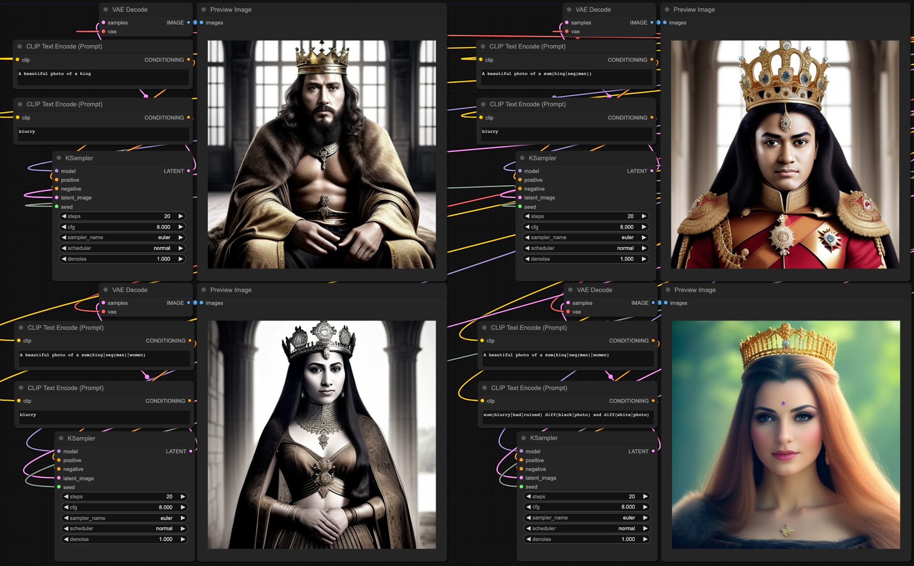

# KepPromptLang

A small DSL for ComfyUI that lets you do math on CLIP token embeddings before they're fed into the text transformer.

```
sum(diff(king|man)|woman)
norm(sum(cat | dog | horse | parrot))
A slerp(cat|dog|0.5) is happy
```

## Install

Clone into `ComfyUI/custom_nodes/`:

```bash
cd ComfyUI/custom_nodes
git clone <repo-url> KepPromptLang
pip install -r KepPromptLang/requirements.txt
```

## Usage

1. Add a **Special CLIP Loader** node and feed it the CLIP output from your **Load Checkpoint**.
2. Pass the wrapped CLIP into a standard **CLIP Text Encode** node.
3. Use the DSL syntax in your prompt.

To debug what your DSL is doing, add a **PromptLang Inspect** node — it shows the per-slot weight, L2 norm, and nearest-vocab words for the resolved embeddings.

See `examples/WIP_Example_workflow.json` for a working workflow.



## Syntax

| Element | Syntax | Example |
| --- | --- | --- |
| Plain word | alphanumeric (with `,_.-`) | `cat`, `dog_face` |
| Quoted string | single or double quotes | `"hello world"`, `'it\'s sunny'` |
| Weighted | `(text:weight)` or `emph(text\|weight)` | `(cat:1.3)`, `emph(cat\|1.3)` |
| Embedding (textual inversion) | `embedding:NAME` | `embedding:face_vector` |
| Function | `name(arg \| arg \| ...)` | `sum(king \| woman)` |

Arguments inside a function are separated by `|`. Each arg can itself be plain text, an embedding, a quoted string, or another function call.

### Variables and comments

```
$axis = diff(king|queen);   # name an expression
sum(actor|$axis) and reject(doctor|$axis)
```

`$NAME = arg;` binds a name; `$NAME` substitutes it. Single-pass: define before use, no reassignment. `#` comments run to end of line. Substitution is structural — multiple refs share the same parsed action object, but actions are evaluated per occurrence (so `$r = rand(3); $r $r` re-rolls each use).

## Quick examples

- Average two prompts: `avg(The cat is | The dog is | 0.5)`
- Normalize a sum: `norm(sum(cat | dog | horse))`
- King − Man + Woman: `sum(diff(king|man)|woman)` (or `sum(king | neg(man) | woman)`)
- Negate an embedding: `neg(embedding:body_vector)`

## Functions

| Display Name | Action Name | Description | Usage Examples |
| --- | --- | --- | --- |
| Average | avg | Performs a weighted average between two segments or actions. The recommended weight is 0 - 1. | <ul><li>avg(The cat is\|The dog is\|0.5)</li><li>avg(Cat\|Dog\|0.5)</li></ul> |
| Difference | diff | Subtracts the segments in the order they are given. The first segment is subtracted from the second, then the third from the result, and so on. | <ul><li>diff(The cat is\|The dog is)</li><li>diff(Cat\|Dog)</li><li>sum(diff(king\|man)\|woman)</li></ul> |
| Multiply | mult | Multiplies the provided segments or actions by the multiplier. | <ul><li>mult(The cat is\|2.5)</li><li>mult(Cat\|-1)</li></ul> |
| Nearest Vocab | nearest | Snaps a computed vector to the k nearest real vocabulary tokens (by cosine similarity), returning their embeddings concatenated. The input is mean-pooled before lookup. | <ul><li>nearest(sum(diff(king\|man)\|woman))</li><li>nearest(sum(red\|blue)\|3)</li></ul> |
| Negate | neg | Negates the provided segments or actions. | <ul><li>neg(cat)</li><li>sum(king\|neg(man)\|women)</li></ul> |
| Noise | noise | Adds Gaussian noise (mean 0, given std) to the embeddings of the first argument. | <ul><li>A noise(cat\|0.05) on a sunny day</li></ul> |
| Normalize | norm | Normalizes the provided segments or actions. | <ul><li>norm(cat)</li><li>sum(cat\|norm(sum(tiger\|fish)))</li></ul> |
| Positional Embedding Scale | posScale | Scales (multiplies) the positional embeddings of the provided segments or actions by the multiplier. | <ul><li>A posScale(cat\|1.5) on a rainy day</li></ul> |
| Ignore Positional Embeddings | postPos | Prevents positional embeddings from being applied to the provided segments or actions. | <ul><li>A postPos(cat) on a rainy day</li></ul> |
| Project | proj | Projects the first argument onto the direction of the second (mean, unit-normalized). | <ul><li>proj(king\|gender)</li><li>diff(style\|proj(style\|photorealistic))</li></ul> |
| Random Embedding | rand | Returns a random embedding of the specified token length, with the values optionally bounded by the second and third arguments. | <ul><li>A rand(1) cat</li><li>A rand(1\|-1\|1) cat</li></ul> |
| Reject | reject | Removes the component of the first argument along the direction of the second (a - proj(a\|b)). | <ul><li>reject(anime girl\|anime)</li></ul> |
| Renormalize | renorm | Rescales the first argument so each token's L2 norm matches the (mean) L2 norm of the reference. | <ul><li>renorm(sum(king\|neg(man)\|woman)\|queen)</li></ul> |
| Scale Dimensions | scaleDims | Scales the specified dimensions of the input embeddings by the specified amount | <ul><li>The scaleDims(cat\|4,1.5\|76,1.2) is happy</li></ul> |
| Set Dimensions | setDims | Sets the specified dimensions of the input embeddings to the specified value | <ul><li>The setDims(cat\|4, -0.01253\|76, 1.2) is happy</li></ul> |
| Slerp | slerp | Performs a slerp (interpolation) between two segments or actions, with the given weight. The recommended weight is 0 - 1. | <ul><li>The slerp(cat\|dog\|0.5) is happy</li></ul> |
| Sum | sum | Adds the embeddings of the provided segments or actions. | <ul><li>A happy sum(cat\|dog\|shark)</li></ul> |

`lerp(a|b|t)` is also accepted as an alias for `avg(a|b|t)`.

Regenerate the table with `python tools/build_docs.py`.

## Development

Tests are pytest-based and don't require ComfyUI:

```bash
pip install -e ".[dev]"
python -m pytest
```

## Compatibility

- SD1.x (CLIP-L) and SDXL (CLIP-L + CLIP-G).
- SD2 is not supported.
- Two pooler-output actions (`_exp-pooler`, `_exp-pooledAvg`) from earlier versions were experimental and have been removed; they relied on direct HuggingFace transformer access that is no longer how ComfyUI structures its CLIP encoders.
